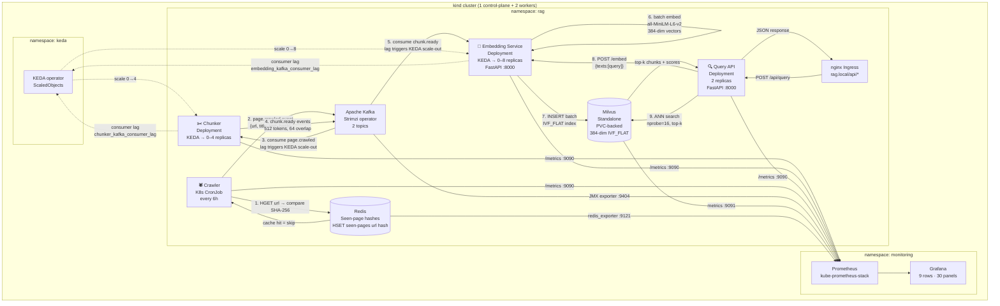

# rag-pipeline-k8s

A production-grade Retrieval-Augmented Generation (RAG) pipeline running entirely on Kubernetes, designed to demonstrate **platform engineering depth** — not ML novelty.

The focus is on the infrastructure that makes AI systems reliable and observable at scale: event-driven autoscaling, self-hosted vector storage, incremental data pipelines, and first-class Prometheus/Grafana observability. The ML components (a sentence-transformer embedding model, cosine similarity search) are intentionally simple so the engineering decisions are the story.

**Project 1 of 4** in an AI infrastructure series. The embedding service is designed to be swapped for NVIDIA Triton in [Project 2: keda-triton-autoscaler](#-project-series).

---

## Architecture



---

## Component summary

| Component | Kind | Image size | Scaling | Key design decision |
|---|---|---|---|---|
| **Crawler** | CronJob (every 6h) | ~120 MB | N/A | Incremental diff via SHA-256 + Redis — only emits changed pages |
| **Chunker** | Deployment | ~180 MB | KEDA 0→4 on `page.crawled` lag | Manual Kafka offset commit — offset advances only after all chunks produced |
| **Embedding Service** | Deployment | ~2.1 GB | KEDA 0→8 on `chunk.ready` lag | `embed()` isolated behind a clean interface — Triton swap is one function body |
| **Query API** | Deployment | ~60 MB | Manual (2 replicas) | HTTP delegation to embedding-service — no model in query path, lean image |
| **Kafka** | Strimzi (operator) | — | N/A | 2 topics: `page.crawled` (3 partitions), `chunk.ready` (6 partitions) |
| **Milvus** | StatefulSet (Helm) | — | N/A | Schema defined as versioned code, not ad hoc; IVF_FLAT index for <500K vectors |
| **Redis** | StatefulSet (Helm) | — | N/A | Single hash key `seen-pages` maps URL → SHA-256 |

---

## Data flow walkthrough

### Ingest path (triggered by CronJob)

```
1. Crawler fetches kubernetes.io/sitemap.xml → filters /docs/concepts/ URLs
2. For each URL: fetch page, extract text (strip nav/header/footer), SHA-256 hash
3. Redis HGET seen-pages <url>:
     • Hash matches → skip (no downstream work)
     • Hash differs or missing → emit page.crawled event, Redis HSET
4. Chunker consumes page.crawled, splits text into 512-token windows (64-token overlap),
   emits one chunk.ready event per chunk
5. Embedding Service batch-consumes chunk.ready (up to 32 chunks OR 2s timeout),
   runs all-MiniLM-L6-v2 inference, inserts 384-dim vectors into Milvus rag_chunks
```

### Query path (on every POST /api/query)

```
1. Ingress → query-api /query
2. Query API calls embedding-service POST /embed with the query text
3. Embedding Service runs inference → returns 384-dim vector
4. Query API calls Milvus ANN search (COSINE metric, nprobe=16, top-k results)
5. Returns chunks + cosine similarity scores to caller
```

---

## Why KEDA over HPA

Standard Kubernetes HPA scales on CPU or memory. For a streaming pipeline, CPU is the wrong signal — and missing scale-to-zero makes it inappropriate entirely.

### The lag-based scaling argument

When the crawler emits 200 `page.crawled` events, the chunker's Kafka consumer lag jumps immediately to 200. CPU on the chunker pods is near-zero until they start processing. By the time CPU rises, you've already queued up latency. KEDA with a Kafka trigger reacts to the actual queue depth — the signal that reflects real work.

Concretely, this project's thresholds:

| Component | KEDA trigger | `lagThreshold` | What it means |
|---|---|---|---|
| Chunker | `chunk.ready` consumer lag | `5` | 1 new replica per 5 unprocessed pages; max 4 replicas |
| Embedding Service | `chunk.ready` consumer lag | `10` | 1 new replica per 10 unprocessed chunks; max 8 replicas |

The embedding service threshold is 2× the chunker's because:
1. Embedding is the bottleneck — each replica processes ~30 chunks/sec on CPU
2. A higher threshold avoids over-scaling on small bursts (a single page produces ~5-10 chunks)
3. Model load time is ~10s per replica — aggressive scale-out would waste that startup cost

### Scale-to-zero is a first-class requirement

Between crawl runs (up to 6h), there are no `page.crawled` or `chunk.ready` events. HPA cannot scale a deployment to zero. KEDA's `minReplicaCount: 0` means the chunker and embedding service consume zero CPU and memory between windows — critical when running inference hardware.

### Cooldown is decoupled from scale-out

KEDA's `cooldownPeriod` controls how long to wait before scaling in after lag drops to zero. We set:
- Chunker: `120s` — conservative enough to drain a full crawl batch before any replica terminates
- Embedding Service: `180s` — longer because model load (~10s) makes thrashing expensive

HPA uses a single stabilization window for both scale-out and scale-in. For this workload, you want aggressive scale-out (react immediately to new lag) and conservative scale-in (don't terminate replicas that might still be processing the tail of a batch). KEDA gives you both dials independently.

---

## Incremental crawl design

The crawler computes `SHA-256(extracted_text)` per page and compares it against a Redis hash map (`HSET seen-pages <url> <hash>`).

**Why hash extracted text, not raw HTML?**
Navigation menus, cookie banners, and sidebar links on kubernetes.io change frequently and independently of content. Hashing raw HTML would trigger a re-embed for every minor site-chrome update. Extracting only `<main>` / `<article>` content (stripping `nav`, `header`, `footer`, `aside`) before hashing means only genuine content changes propagate downstream.

**Result:** on a docs site that updates a handful of pages per day, ~95% of pages are skipped on each crawl run. The `crawler_pages_skipped_total` / `crawler_pages_crawled_total` ratio in Grafana shows this efficiency directly.

**Tradeoff:** requires a Redis dependency and slightly more complex crawler logic. Both are acceptable for a production system — Redis is already required for session state / caching in most services.

---

## The Triton swap point

The embedding service exposes one function:

```python
# embedding-service/src/embedder.py
def embed(texts: list[str]) -> list[list[float]]:
    ...
```

The current implementation calls `SentenceTransformer.encode()`. To swap in NVIDIA Triton (Project 2 in this series), the only change is this function body — replace it with a Triton gRPC client call:

```python
# Project 2: replace with
import tritonclient.grpc as grpcclient
client = grpcclient.InferenceServerClient(url="triton:8001")
# ... build InferInput, call client.infer()
```

The Kafka consumer, batch accumulation logic, Milvus write path, FastAPI `/embed` endpoint, KEDA ScaledObject, Deployment manifest, and Prometheus metrics are all unchanged. The interface is the seam.

See [`embedding-service/src/embedder.py`](embedding-service/src/embedder.py) for the full docstring explaining this contract.

---

## Repo structure

```
rag-pipeline-k8s/
├── crawler/                        K8s CronJob — incremental page crawler
│   ├── src/
│   │   ├── config.py               Typed Config from env vars
│   │   ├── metrics.py              Prometheus counters
│   │   ├── redis_store.py          SeenPagesStore (HGET/HSET)
│   │   ├── producer.py             page.crawled Kafka producer
│   │   ├── crawler.py              Sitemap fetch, text extraction, hash, emit
│   │   └── main.py                 Entrypoint
│   ├── Dockerfile                  Multi-stage; libxml2 runtime only
│   └── README.md
├── chunker/                        K8s Deployment, KEDA-scaled
│   ├── src/
│   │   ├── config.py
│   │   ├── metrics.py
│   │   ├── chunker.py              Fixed-size tiktoken windows with overlap
│   │   ├── consumer.py             Manual-commit consumer, SIGTERM-safe
│   │   ├── producer.py             chunk.ready producer
│   │   └── main.py                 flush() before commit() — at-least-once delivery
│   ├── Dockerfile                  Pre-caches tiktoken BPE data at build time
│   └── README.md
├── embedding-service/              K8s Deployment, KEDA-scaled
│   ├── src/
│   │   ├── config.py
│   │   ├── metrics.py
│   │   ├── embedder.py             ◀ TRITON SWAP POINT — embed() interface
│   │   ├── milvus_schema.py        Authoritative collection schema v1
│   │   ├── milvus_client.py        Batch insert + search
│   │   ├── consumer.py             Batching consumer (32 chunks OR 2s timeout)
│   │   ├── api.py                  FastAPI POST /embed + GET /health
│   │   └── main.py                 Dual-thread: consumer (main) + uvicorn (daemon)
│   ├── Dockerfile                  3-stage: builder, model-downloader, runtime
│   └── README.md
├── query-api/                      K8s Deployment, 2 replicas
│   ├── src/
│   │   ├── config.py
│   │   ├── metrics.py
│   │   ├── embedding_client.py     HTTP client → embedding-service /embed
│   │   ├── milvus_client.py        Search-only (no insert)
│   │   ├── api.py                  FastAPI POST /query + GET /health
│   │   └── main.py
│   ├── Dockerfile                  Lean 2-stage; no model (~60 MB image)
│   └── README.md
├── helm/
│   └── rag-pipeline/               Umbrella Helm chart
│       ├── Chart.yaml              Redis + Milvus as subchart dependencies
│       ├── values.yaml             All config with inline comments
│       ├── dashboards/             Grafana dashboard JSON (auto-imported via ConfigMap)
│       └── templates/
│           ├── namespace.yaml
│           ├── kafka-cluster.yaml              Strimzi Kafka CR
│           ├── kafka-topics.yaml               KafkaTopic CRs (page.crawled, chunk.ready)
│           ├── kafka-metrics-configmap.yaml    JMX exporter rules
│           ├── milvus-init-job.yaml            Helm post-install hook: creates collection + index
│           ├── crawler-cronjob.yaml
│           ├── chunker-deployment.yaml
│           ├── embedding-service-deployment.yaml
│           ├── query-api-deployment.yaml       Includes Service + Ingress
│           ├── servicemonitors.yaml            ServiceMonitors + PodMonitors for all components
│           ├── podmonitor-crawler.yaml         PodMonitor for ephemeral CronJob pods
│           ├── prometheusrule.yaml             7 alerting rules
│           └── grafana-dashboard-configmap.yaml  Auto-imported by Grafana sidecar
├── k8s/
│   ├── keda/
│   │   ├── chunker-scaledobject.yaml           lagThreshold=5, cooldown=120s
│   │   └── embedding-scaledobject.yaml         lagThreshold=10, cooldown=180s
│   └── ingress/
│       └── query-api-ingress.yaml
├── dashboards/
│   └── rag-pipeline-grafana.json   9 rows, 30 panels — copy of helm/rag-pipeline/dashboards/
├── scripts/
│   ├── setup-local.sh              Idempotent bootstrap (kind → operators → chart → health check)
│   └── health-check.sh             Smoke tests: Kafka Ready, topics, Redis PING, Milvus, KEDA, monitors
├── kind-config.yaml                1 control-plane + 2 workers, host ports 8080/8443
├── Makefile                        setup, deploy, health, crawl, query, port-forward targets
└── README.md
```

---

## Quick start

### Prerequisites

```bash
# Install these before running make setup
brew install kind kubectl helm   # macOS; adjust for your OS
```

### Spin up the full stack

```bash
git clone https://github.com/your-org/rag-pipeline-k8s
cd rag-pipeline-k8s

make setup        # ~10 min: kind cluster + operators + infra + app components
make health       # verify all components are up
make status       # pod overview across all namespaces
```

### Trigger a crawl and query

```bash
make crawl        # triggers a one-off CronJob run
# watch the pipeline:
kubectl logs -n rag -l app.kubernetes.io/name=crawler -f
kubectl logs -n rag -l app.kubernetes.io/name=chunker -f
kubectl logs -n rag -l app.kubernetes.io/name=embedding-service -f

# query (in a separate terminal):
make port-query   # background: forwards :8000
make query        # POST /query with a sample question
```

### Observe

```bash
make port-prometheus   # http://localhost:9090
make port-grafana      # http://localhost:3000 (admin / admin)
                       # Dashboard auto-loaded under: Dashboards → RAG Pipeline
```

---

## Prometheus metrics

Each service exposes metrics on `:9090/metrics`. Kafka JMX metrics are scraped on `:9404` via a Strimzi sidecar.

| Metric | Service | Type | Description |
|---|---|---|---|
| `crawler_pages_crawled_total` | crawler | Counter | Pages fetched from sitemap |
| `crawler_pages_emitted_total` | crawler | Counter | Pages emitted (new or changed) |
| `crawler_pages_skipped_total` | crawler | Counter | Pages skipped (hash unchanged) |
| `crawler_sitemap_urls_found` | crawler | Gauge | URLs matching filter in sitemap |
| `chunker_chunks_produced_total` | chunker | Counter | Total chunk.ready events published |
| `chunker_kafka_consumer_lag` | chunker | Gauge | Live lag on page.crawled (mirrors KEDA signal) |
| `chunker_chunks_per_page` | chunker | Histogram | Chunks produced per input page |
| `chunker_chunk_size_tokens` | chunker | Histogram | Token count per chunk |
| `embedding_chunks_embedded_total` | embedding-service | Counter | Chunks embedded + inserted |
| `embedding_throughput_chunks_per_sec` | embedding-service | Gauge | Rolling 60s throughput |
| `embedding_inference_latency_seconds` | embedding-service | Histogram | Model inference time per batch |
| `embedding_milvus_insert_latency_seconds` | embedding-service | Histogram | Milvus insert time per batch |
| `embedding_kafka_consumer_lag` | embedding-service | Gauge | Live lag on chunk.ready |
| `embedding_api_latency_seconds` | embedding-service | Histogram | POST /embed latency (query path) |
| `query_api_requests_total` | query-api | Counter | Requests by status (success/error) |
| `query_api_latency_seconds` | query-api | Histogram | End-to-end query latency |
| `query_api_embed_call_latency_seconds` | query-api | Histogram | Time to call /embed |
| `query_api_milvus_search_latency_seconds` | query-api | Histogram | Milvus ANN search time |
| `kafka_topic_messages_in_per_sec` | Kafka (JMX) | Gauge | Messages/sec by topic |
| `kafka_consumer_lag` | Kafka (JMX) | Gauge | Broker-side lag per group/topic/partition |
| `kafka_server_under_replicated_partitions` | Kafka (JMX) | Gauge | Under-replicated partitions (should be 0) |

---

## Alerting rules

Seven PrometheusRules defined in `helm/rag-pipeline/templates/prometheusrule.yaml`:

| Alert | Condition | Severity | `for` |
|---|---|---|---|
| `ChunkerKafkaLagCritical` | chunker lag > 20 (2× threshold × maxReplicas) | critical | 5m |
| `EmbeddingKafkaLagCritical` | embedding lag > 80 | critical | 5m |
| `QueryApiHighP99Latency` | query p99 > 500ms | warning | 5m |
| `QueryApiHighErrorRate` | error rate > 5% | critical | 2m |
| `MilvusInsertLatencyHigh` | insert p99 > 1s | warning | 5m |
| `EmbeddingThroughputZero` | throughput=0 AND lag>0 | warning | 10m |
| `KafkaUnderReplicatedPartitions` | under-replicated > 0 | warning | 2m |

Alert thresholds are in `values.yaml` under `monitoring.alerts` so they can be tuned per environment without touching the template.

---

## What I'd change for production scale

### 1. Triton instead of FastAPI for embedding (Project 2)
FastAPI + sentence-transformers works well at this scale but has fundamental throughput limits: the GIL serialises concurrent inference calls, and the Python HTTP server adds latency. NVIDIA Triton serves models via gRPC with dynamic batching, concurrent model execution, and native GPU support. The swap requires only changing `embedder.py`'s function body — everything else is unchanged by design.

### 2. Multi-tenant Milvus collections
The current design uses a single `rag_chunks` collection. For multi-tenant use, partition by tenant ID or route to separate collections. The query-api would need a `tenant_id` field in the request and a routing layer that selects the right collection. The Milvus schema is versioned in `milvus_schema.py` — adding a `tenant_id` VARCHAR field is a schema migration (drop + recreate + re-embed).

### 3. Schema registry for Kafka events
`page.crawled` and `chunk.ready` events are plain JSON with no enforcement. A producer could emit a malformed event and silently break the consumer. In production, use Confluent Schema Registry (or Apicurio) with Avro or Protobuf schemas. KEDA's Kafka trigger still works with schema-validated topics.

### 4. Dead-letter topics for failed batches
Currently, if the embedding service fails to insert a batch into Milvus, it logs the error and does not commit the Kafka offset — the batch will be redelivered on restart. After N retries it will continue to block the partition. A `chunk.failed` dead-letter topic would allow failed chunks to be inspected and reprocessed separately without blocking the main pipeline.

### 5. HNSW index at >500K vectors
The current Milvus index is `IVF_FLAT` with `nlist=128`. This gives good recall at <500K vectors with fast build time. For >500K vectors, switch to HNSW with `M=16`, `ef_construction=200` — better ANN throughput at the cost of higher memory usage and longer index build time. This is a configuration change in `milvus_schema.py` and the init job.

### 6. Separate Kafka consumer groups per embedding replica
Currently all embedding-service replicas share a single consumer group (`embedding-group`). Kafka distributes `chunk.ready` partitions across replicas in the group. With 6 partitions and 8 max replicas (from KEDA), 2 replicas will always be idle (no assigned partitions). Setting partition count ≥ max replicas, or using KEDA's `minReplicaCount` equal to the partition count, would fix this.

---

## Explicit non-goals

These are intentionally out of scope for this project:

- ❌ Multi-user auth / API keys / tenant isolation
- ❌ Multiple embedding models or model comparison
- ❌ Generic crawler framework — hardcoded to kubernetes.io/docs/concepts/
- ❌ Cloud-managed Kafka or Milvus — fully self-hosted only
- ❌ Reranking, query expansion, or RAG quality evaluation

---

## 🔗 Project series

| # | Project | Status | Description |
|---|---|---|---|
| 1 | **rag-pipeline-k8s** | ✅ Complete | End-to-end RAG on Kubernetes with KEDA Kafka-lag autoscaling |
| 2 | keda-triton-autoscaler | 🔜 Next | Replace FastAPI embedding with NVIDIA Triton; GPU-aware autoscaling |
| 3 | TBD | — | Model serving observability (Triton metrics → Prometheus → Grafana) |
| 4 | TBD | — | Multi-model inference routing and canary deployments |

---

## Target site

The crawler targets `kubernetes.io/docs/concepts/` — specifically the subtree listed in the sitemap at `https://kubernetes.io/sitemap.xml`. This is a deliberate choice: K8s docs are well-structured, publicly available, technically relevant to the audience reading this repo, and stable enough to produce reproducible demos. The crawler respects `robots.txt` and rate-limits to 1 request/second.

---

## License

MIT
