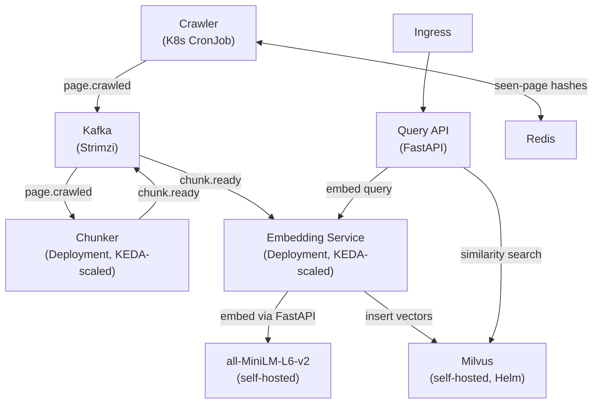

# rag-pipeline-k8s

A production-grade Retrieval-Augmented Generation (RAG) pipeline running entirely on Kubernetes, designed to demonstrate platform engineering depth for AI infrastructure roles.

This is **Project 1 of 4** in an AI infrastructure series. The embedding service in this project is deliberately designed to be swapped for NVIDIA Triton in [Project 2: keda-triton-autoscaler](#future-projects).

---

## Architecture



### Component summary

| Component | Kind | Scaling | Role |
|---|---|---|---|
| Crawler | CronJob | N/A (scheduled) | Crawls target site, emits only new/changed pages |
| Chunker | Deployment | KEDA on `page.crawled` lag | Fixed-size chunks with overlap |
| Embedding Service | Deployment | KEDA on `chunk.ready` lag | Self-hosted MiniLM, writes to Milvus |
| Milvus | StatefulSet (Helm) | Manual | Vector store |
| Query API | Deployment | HPA or manual | Embeds query, searches Milvus |
| Kafka | Strimzi | N/A | Event bus between components |
| Redis | Deployment (Helm) | N/A | Seen-page hash store for crawler dedup |

---

## Why KEDA over HPA for this pipeline

Standard Kubernetes HPA scales on CPU or memory. For a streaming pipeline, CPU is the wrong signal:

- **Lag is the real queue depth.** When a batch of pages is crawled, Kafka consumer lag on `chunk.ready` immediately tells you how many chunks are waiting to be embedded. CPU on the embedding pod may be near-zero until a worker picks up a message — by the time CPU rises, you've already introduced latency.
- **Scale-to-zero matters.** Between crawl runs there is no work. HPA cannot scale a deployment to zero replicas. KEDA's `minReplicaCount: 0` means the chunker and embedding service consume no resources between crawl windows — critical when running self-hosted GPUs or burstable node pools.
- **Lag thresholds are business-meaningful.** Setting `lagThreshold: 10` on the chunker means "start a new replica when there are 10 unprocessed pages." You can reason about this in terms of crawl batch size and target embedding latency, not arbitrary CPU percentages.
- **Cooldown is decoupled from scale-out.** KEDA's `cooldownPeriod` lets scale-in be conservative (avoid thrashing) while scale-out is aggressive (don't let lag grow). HPA uses a single stabilization window for both directions.

In short: for event-driven, bursty, batch-triggered workloads, KEDA with a Kafka lag trigger is strictly better than CPU-based HPA.

---

## Incremental crawl design

The crawler computes a SHA-256 hash of each page's content and checks it against a Redis hash store (`HSET seen-pages <url> <hash>`). It only emits a `page.crawled` event when:

- The URL has never been seen (new page), or
- The stored hash differs from the current hash (changed page)

This means the downstream pipeline only processes work that actually changed. On a docs site that updates a few pages per day, this reduces embedding compute by ~95% compared to a naive full-recrawl strategy. The tradeoff is a Redis dependency and slightly more complex crawler logic — both acceptable for a production system.

---

## Repo structure

```
rag-pipeline-k8s/
├── crawler/                  # K8s CronJob — crawls target site
│   ├── src/
│   ├── Dockerfile
│   └── README.md
├── chunker/                  # K8s Deployment — consumes page.crawled, produces chunk.ready
│   ├── src/
│   ├── Dockerfile
│   └── README.md
├── embedding-service/        # K8s Deployment — embeds chunks, writes to Milvus
│   ├── src/
│   ├── Dockerfile
│   └── README.md
├── query-api/                # K8s Deployment — query endpoint, exposed via Ingress
│   ├── src/
│   ├── Dockerfile
│   └── README.md
├── helm/
│   └── rag-pipeline/         # Umbrella Helm chart
│       ├── Chart.yaml
│       ├── values.yaml
│       └── charts/           # Subcharts: kafka, redis, milvus, crawler, chunker, embedding-service, query-api
├── k8s/
│   ├── keda/                 # KEDA ScaledObject manifests
│   └── ingress/              # Ingress manifest for query-api
├── dashboards/               # Grafana dashboard JSON
└── README.md
```

---

## Prerequisites

- Kubernetes cluster (local: kind or k3d recommended)
- Helm 3.x
- kubectl
- KEDA installed in the cluster (`helm install keda kedacore/keda -n keda --create-namespace`)
- Strimzi Kafka operator (`helm install strimzi strimzi/strimzi-kafka-operator -n strimzi --create-namespace`)

---

## Quick start

```bash
# 1. Install infra (Kafka, Redis, Milvus)
helm dependency update helm/rag-pipeline
helm install rag helm/rag-pipeline -n rag --create-namespace -f helm/rag-pipeline/values.yaml

# 2. Apply KEDA ScaledObjects
kubectl apply -f k8s/keda/ -n rag

# 3. Trigger a crawl manually
kubectl create job --from=cronjob/crawler manual-crawl-1 -n rag

# 4. Query
curl http://<ingress-host>/query -d '{"text": "how does X work", "top_k": 5}'
```

---

## Metrics exposed

Each service exposes Prometheus metrics on `:9090/metrics`:

| Metric | Service | Description |
|---|---|---|
| `crawler_pages_crawled_total` | crawler | Total pages fetched |
| `crawler_pages_emitted_total` | crawler | Pages emitted (new or changed) |
| `chunker_chunks_produced_total` | chunker | Total chunks produced |
| `chunker_kafka_consumer_lag` | chunker | Current lag on page.crawled topic |
| `embedding_chunks_embedded_total` | embedding-service | Total chunks embedded |
| `embedding_throughput_chunks_per_sec` | embedding-service | Rolling embedding throughput |
| `embedding_milvus_insert_latency_seconds` | embedding-service | Histogram of Milvus insert latency |
| `query_api_requests_total` | query-api | Total query requests |
| `query_api_latency_p99_seconds` | query-api | p99 query latency (embed + search) |

---

## What I'd change for production scale

1. **Multi-tenant Milvus collections** — current design uses a single `rag_chunks` collection. For multi-tenant, partition by tenant ID or use separate collections with a routing layer in the query API.
2. **Triton instead of FastAPI for embedding** — the embedding call is behind a clean `embed(texts: list[str]) -> list[list[float]]` interface in `embedding-service/src/embedder.py`. Swapping the implementation to a Triton gRPC client is the only change needed. This is Project 2 in this series.
3. **Schema registry for Kafka events** — `page.crawled` and `chunk.ready` events are currently plain JSON. In production, use Confluent Schema Registry (or Apicurio) with Avro/Protobuf schemas to enforce contract between producer and consumer.
4. **Milvus index tuning** — current setup uses default FLAT index. For >1M vectors, switch to HNSW with tuned `ef_construction` and `M` parameters. Index choice should be driven by recall vs. latency tradeoff at the target scale.
5. **Dead-letter topics** — no DLQ currently. Failed embed or insert should go to a `chunk.failed` topic for reprocessing, not be silently dropped.

---

## Future projects in this series

| # | Project | Description |
|---|---|---|
| 1 | **rag-pipeline-k8s** (this) | End-to-end RAG on K8s with KEDA Kafka-lag autoscaling |
| 2 | keda-triton-autoscaler | Replace FastAPI embedding service with NVIDIA Triton; GPU-aware autoscaling |
| 3 | TBD | Model serving observability (Prometheus + Grafana for Triton metrics) |
| 4 | TBD | Multi-model inference routing / canary deployments |

---

## Target site for demo

The crawler targets **[Kubernetes documentation](https://kubernetes.io/docs/)** — specifically the `concepts/` subtree. It respects `robots.txt` and rate-limits to 1 req/sec. The sitemap is at `https://kubernetes.io/sitemap.xml`.

This is a deliberate choice: K8s docs are well-structured, stable enough to produce reproducible demos, and technically relevant to the audience.

---

## License

MIT
